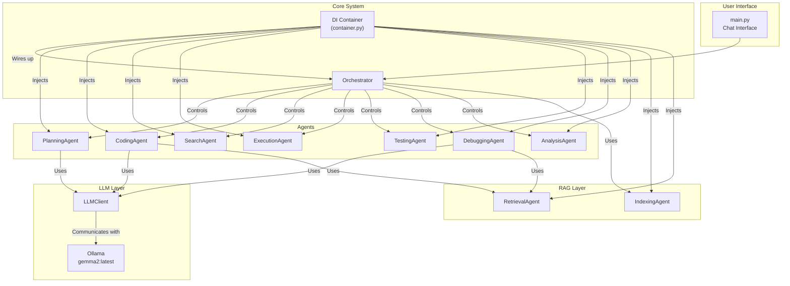

# **AIDA: AI-Driven Assistant**

AIDAは、対話形式でソフトウェア開発タスクを自動化するAIアシスタントです。ユーザーからの自然言語による指示に基づき、プロジェクトの分析、開発計画の立案、コーディング、検索、実行、そしてテストまでを自律的に実行します。

## **🚀 特徴**

- **対話型インターフェース**: チャット形式で開発タスクを依頼できます
- **自律的なタスク実行**: ユーザーの指示を解釈し、必要なアクション（ファイル検索、コード編集、コマンド実行、テスト）を自ら計画し、実行します
- **動的なワークフロー**: 固定的な手順ではなく、タスクの内容に応じて「分析 → 計画 → 実行 → 検証」のサイクルを柔軟に繰り返します
- **LangChain統合**: LLMとのやり取りを構造化し、安定した計画やコードの生成を実現します
- **クリーンなアーキテクチャ**: DIコンテナ（dependency-injector）を導入し、保守性の高い設計になっています
- **安全なサンドボックス環境**: コードの実行やファイル変更は、まず隔離されたサンドボックス環境で行われ、タスク完了後に実際のワークスペースに反映されるため安全です

## **🏁 利用開始までの流れ**

### **1. 前提条件**

- Python 3.10以上
- [Ollama](https://ollama.com/)がローカルで実行されていること

Ollamaをインストール後、ターミナルで以下のコマンドを実行して、サーバーを起動し、使用するモデルをダウンロードしてください。

```bash
# Ollamaサーバーを起動 (ターミナルは起動したままにします)
ollama serve

# 別のターミナルを開き、モデルをダウンロード
ollama pull gemma2:latest
```

### **2. インストール**

1. **プロジェクトの準備**:
   このプロジェクト（aidaディレクトリ）を任意の場所に配置します。

2. **仮想環境の作成**:
   ```bash
   python3 -m venv .venv
   source .venv/bin/activate  # Linux/macOS
   # または
   .venv\Scripts\activate     # Windows
   ```

3. **依存関係のインストール**:
   プロジェクトルートにあるrequirements.txtを使ってインストールします。
   ```bash
   pip install -r requirements.txt
   ```

### **3. 実行方法**

プロジェクトのルートディレクトリ（aidaディレクトリの親）で、以下のコマンドを実行します。

```bash
python -m aida.main
```

実行すると、`--- AIDA: AI-Driven Assistant ---`というメッセージと共にプロンプトが表示されます。

### **4. 使い方**

`Prompt >` が表示されたら、開発タスクを入力してください。

**例:**

- `aida/workspace/app.pyに「def get_status(): return "ok"」という関数を追加してください`
- `project_analyzer.py というファイルがどこにあるか探して`
- `workspace/app.py を実行して`
- `math_utils.py のバグを修正するためのテストを作成して、そのテストを実行して`

システムが計画を立て、必要なアクション（コード生成、コマンド実行など）を順番に実行します。変更が完了すると、結果がワークスペースに反映されます。

## **📁 プロジェクト構造**

```
.
├── aida/
│   ├── agents/         # 各機能担当のエージェント
│   │   ├── analysis_agent.py
│   │   ├── coding_agent.py
│   │   ├── debugging_agent.py
│   │   ├── execution_agent.py  # コマンド実行
│   │   ├── planning_agent.py
│   │   ├── search_agent.py
│   │   └── testing_agent.py
│   ├── analysis/       # プロジェクト分析関連
│   ├── rag/            # RAG (Retrieval-Augmented Generation) 関連
│   ├── workspace/      # AIDAが作業する対象のプロジェクト
│   ├── __init__.py
│   ├── config.yml      # 設定ファイル
│   ├── container.py    # DIコンテナ
│   ├── llm_client.py   # LLM通信クライアント
│   ├── main.py         # アプリケーションのエントリーポイント
│   ├── orchestrator.py # 全体を統括するオーケストレーター
│   ├── schemas.py      # データ構造の定義
│   └── utils.py        # 共通関数
└── requirements.txt    # 依存ライブラリ
```

## **📄 詳細設計仕様書**

### **1. アーキテクチャ概要**

本システムは、**エージェントベースアーキテクチャ**を採用しています。中心的な役割を担うOrchestratorが、ユーザーの指示に基づき、各専門分野（計画、コーディング、検索、実行など）を担当するAgent群を協調させてタスクを遂行します。

クラス間の依存関係は、**DI（Dependency Injection）コンテナ**によって管理されており、各コンポーネントの疎結合性とテスト容易性を高めています。



### **2. コンポーネント詳細**

- **main.py**: アプリケーションの起動、DIコンテナの初期化、ユーザーとの対話ループを担当
- **container.py**: dependency-injectorを使用し、システム全体のクラスのインスタンス生成と依存関係の注入を一元管理
- **orchestrator.py**: ユーザーの指示に基づき、PlanningAgentが立てた計画を実行する司令塔。アクションの種類に応じて適切なエージェントを呼び出し、全体のワークフローを制御する
- **llm_client.py**: Ollamaサーバーとの通信をカプセル化するクライアント
- **schemas.py**: Pydanticを使用し、エージェント間で交換されるデータ構造（Action, CodeChangeなど）を厳密に定義する
- **agents/**:
  - **planning_agent.py**: ユーザーの要求とプロジェクトの状態を基に、次に行うべきアクション（Actionオブジェクト）を決定する
  - **coding_agent.py**: Actionの指示に基づき、RAG（RetrievalAgent）で得たコンテキストを利用して、コードの生成・修正案（CodeChangeリスト）を作成する
  - **search_agent.py**: プロジェクト内のファイルを対象に、キーワード検索を実行する
  - **execution_agent.py**: pythonスクリプトの実行など、シェルコマンドを安全なサンドボックス内で実行し、結果を返す
  - **testing_agent.py**: pytestを実行し、テスト結果を評価する
  - **debugging_agent.py**: テストが失敗した場合、エラー情報と関連コードをLLMに渡し、修正案を生成させる
  - **analysis_agent.py**: プロジェクトのファイル構造を静的に分析し、メタデータを作成する
- **rag/**:
  - **indexing_agent.py**: プロジェクトのファイルをチャンクに分割し、VectorStoreにインデックスを作成する
  - **retrieval_agent.py**: クエリに基づいて、関連性の高いコード片をVectorStoreから検索する
- **utils.py**: サンドボックス管理など、プロジェクト全体で共有される共通関数を格納する

### **3. データフロー**

ユーザーからのリクエストは、Orchestratorを中心とした動的なループで処理されます。

```mermaid
sequenceDiagram
    participant User
    participant Main
    participant Orchestrator
    participant PlanningAgent
    participant ActionAgents as "[Coding/Search/Exec...]"

    User->>Main: "開発タスクを入力"
    Main->>Orchestrator: "run_task(prompt)"
      
    loop Task Execution Loop
        Orchestrator->>PlanningAgent: "run(goal, history, last_result)"
        PlanningAgent-->>Orchestrator: "次のアクション(Action)"
          
        alt action.type is "finish"
            Orchestrator-->>Main: "タスク完了"
            break
        end

        Orchestrator->>ActionAgents: "action.typeに応じて実行"
        ActionAgents-->>Orchestrator: "実行結果"
        Orchestrator-->>Orchestrator: "last_resultとhistoryを更新"
    end
```

### **4. 主要なデータ構造**

- **Action**: PlanningAgentが生成する、単一の実行単位
  - `type` (str): code, search, executeなど、実行すべきタスクの種類
  - `description` (str): タスクの詳細な指示内容
- **CodeChange**: CodingAgentが生成する、単一のファイル変更
  - `file_path` (str): 変更対象のファイルパス
  - `action` (str): create, update, deleteのいずれか
  - `content` (str): 書き込むファイル全体のコンテンツ

この構造により、LLMが曖昧な応答ではなく、プログラムで直接利用可能な形式で計画やコードを出力することを保証します。

## **🔧 設定**

### **モデルの変更**

デフォルトでは`gemma2:latest`を使用しますが、他のOllamaモデルも利用可能です。

```bash
# 例: より大きなモデルを使用する場合
ollama pull llama2:13b
```

`config.yml`でモデル名を変更することで、使用するモデルを切り替えることができます。

### **ワークスペースの変更**

デフォルトのワークスペースは`aida/workspace/`ですが、設定により他のディレクトリを指定することも可能です。

## **🤝 貢献**

プロジェクトへの貢献を歓迎します。プルリクエストを送信する前に、以下のガイドラインに従ってください：

1. 新しい機能やバグ修正について、まずIssueで議論してください
2. コードスタイルは既存のコードに合わせてください
3. テストを追加し、すべてのテストが通ることを確認してください

## **📝 ライセンス**

このプロジェクトは[MIT License](LICENSE)の下で公開されています。

## **⚠️ 注意事項**

- このシステムは開発中のため、予期しない動作をする場合があります
- 重要なファイルは事前にバックアップを取ることを推奨します
- サンドボックス環境での実行とはいえ、悪意のあるコードの実行には注意が必要です